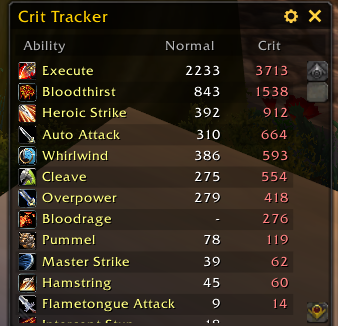
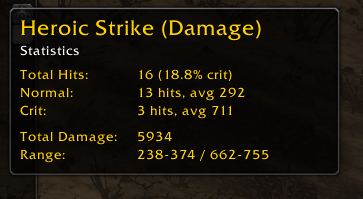

# BattleScribe

A lightweight combat statistics addon for World of Warcraft 1.12 that tracks your highest damage and healing records for each ability.

## Overview

BattleScribe automatically monitors your combat log and records the maximum normal and critical values for every ability you use. Whether you're testing gear, comparing talent builds, or just want to know your personal bests, BattleScribe keeps track of it all.

## Features

### Combat Tracking
- Tracks maximum normal and critical damage/healing for each ability
- Automatically detects spell icons from your spellbook
- Separates abilities by type (damage vs healing)
- Maintains both session-only and all-time records

### Statistics
Hover over any ability to see detailed statistics:
- Crit rate percentage
- Average damage for normal and critical hits
- Total damage/healing dealt
- Minimum and maximum values
- Total hit count

### Interface
- Resizable frame (width and height)
- Compact mode below 250px width shows icons only
- Sortable columns - click headers to sort by name, normal, or crit values
- Draggable window with persistent position
- Alternating row colors for readability

### Filtering
- **Time Period**: View all-time records or current session only
- **Ability Type**: Show all abilities, damage only, or healing only
- Filter settings persist between sessions

### Data Management
- Character-specific tracking
- All settings and data saved automatically
- Reset option to clear data when needed

## Installation

1. Download the addon
2. Extract to `Interface/AddOns/BattleScribe`
3. Restart World of Warcraft
4. Type `/bs` to open the tracker

## Commands

- `/bs` or `/battlescribe` - Toggle the main window
- `/bs reset` - Clear all tracked data for current character
- `/bs help` - Show available commands

## Usage

The addon starts tracking automatically once loaded. Open the window with `/bs` to view your records. Click the cogwheel icon to access settings for filtering and data management.

## Performance

BattleScribe is optimized for minimal memory usage:
- Updates only when records are broken
- Reuses UI frames to prevent memory growth
- Caches spell icons after first lookup
- No performance impact during sustained combat

## Requirements

- World of Warcraft 1.12 client
- Compatible with Turtle WoW and other Vanilla servers

## Support

For issues or feature requests, please open an issue on GitHub.
